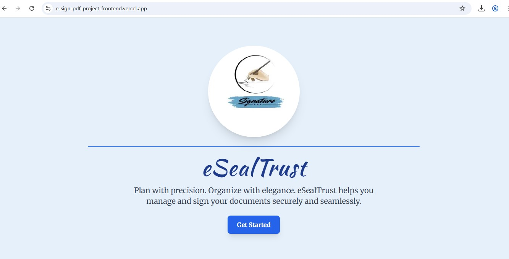
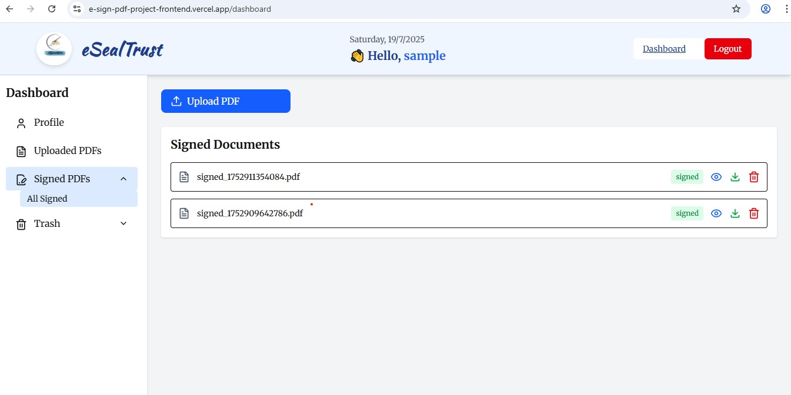

### Welcome to E-Pdf Sign Doc Web Application ***[eSealTrust](https://e-sign-pdf-project-frontend.vercel.app/)***

## Table of contents

- [Project Description](#project-description)
- [Features](#features)
- [Technologies Used](#technologies-used)
- [ScreenShots](#screenshots)
- [Links](#links)
- [Installation](#installation)
- [Usage](#usage)
- [Future Enhancements](#future-enhancements)
- [Author](#author)
- [Contributing](#contributing)
- [Acknowledgments](#acknowledgments)
- [License](#license)
----

## Project Description

A modern web application that enables users to digitally sign PDF documents with ease. Upload your PDF, draw or upload a signature, place it anywhere on the document, and download the finalized version — all within a smooth, responsive interface. Built with React, Node.js, and pdf-lib, this full-stack app offers a seamless and secure e-signing experience.

## Features

###  Core Functionalities
- Upload PDF files from local storage
- Type or Draw or Upload signatures (image or canvas)
-  Drag and place signatures anywhere on the PDF pages
- Finalize and embed the signature into the PDF using pdf-lib
- Download the signed PDF with embedded signatures
- Real-time updates with a clean UI.
- User authentication (Login / Signup).
- Persistent task storage using Supabase DB.
-  Secure file handling with Express and Multer on the backend

## Technologies Used

###  Frontend
- Built with **Next.js + React**.
- Responsive UI with **Tailwind CSS**.
- Interactive design with **Framer Motion**.
- Toast notifications with **react-hot-toast**.
- Iconography using **Lucide React icons**.
- Smooth navigation via **Next.js App Router**.
- Elegant layout structure with **flexbox & grid utilities**.
- Clean, component-driven architecture for scalability.
- Deployment: **Vercel**

###  Backend
- Built with **Node.js + Express.js**.
- RESTful API using **Express.js**.
- Authentication using **JWT + bcrypt**.
- **Cookie-based** session management.
- File handling with **Multer** middleware.
- PDF manipulation using **pdf-lib and pdfjs-dist**.
- Environment-based configuration.
- **Supabase** used as **cloud-hosted PostgreSQL database**.
- Deployment: **Render**

---

##  Screenshots

| Home Page | Login | DashBoard (with filtered and sorted Task Management) |
|------------|-------------------|-------------------|
|  |  |  |

| Pdf Editor | Pdf Preview | Pdf Download |
|------------|-------------------|-------------------|
|  |  |  |

---

## Links
Live site Url: ***[eSealTrust](https://e-sign-pdf-project-frontend.vercel.app/)***

---

##  Installation

### 1. Clone the Repository

```bash
git clone https://github.com/Saras171/e-Seal-Trust-Project.git
cd e-seal-trust-project
```
### 2. Setup Frontend
```bash
cd frontend
npm install
npm run dev
```
### 3. Setup Backend
```bash
cd backend
npm install
npm start
```

🔐 Make sure to configure .env files in both frontend/ and backend/ with appropriate variables like API keys, SUPABASE_URL, JWT_SECRET, etc.

 ### Environment Variables
#### Frontend .env
 ```bash
 NEXT_PUBLIC_API_URL=your_backend_Url/api
 NEXT_PUBLIC_SUPABASE_DOMAIN=(if required)
```
#### Backend .env
```bash
PORT=your_port
JWT_SECRET=your_jwt_secret
SUPABASE_URL=your_supabase_url
SUPABASE_SERVICE_ROLE_KEY=your_supabase_service_role_key
```
---
## Usage

- Open the application in your browser.

- Upload a PDF document through the secure interface.

-  Type or Draw or Upload your digital signature using the signature panel.
- Drag and position the signature(s) directly onto the PDF pages.
- Finalize and download the signed PDF instantly.
- Access the dashboard to view all uploaded and signed documents.
- Delete or preview documents as needed through the user-friendly interface.
- Secure login system to protect access to personal documents.
---
## Future Enhancements

- Notifications and reminder
- Cloud Storage Integration
- Audit Trails
- Role-based Access Control
- Document Sharing with Expiry Links
- Email Notifications
Digital Signature (Certificate-based)

---
## Author
- GitHub Repository: [e Seal Trust Project](https://github.com/Saras171/e-Seal-Trust-Project.git)
## Contributing

Contributions are welcome 🤝! Feel free to submit a pull request.

---

## Acknowledgments

I would like to sincerely thanks 🙏 **Labmentix** for providing me the opportunity through their internship program to work on this project. The guidance, structure, and learning environment offered by the team greatly contributed to enhancing my skills and building this To-Do List web application successfully.

---

## License 

This project is licensed under the [Apache License](/LICENSE).
